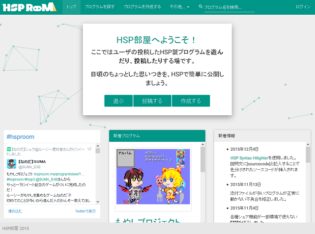
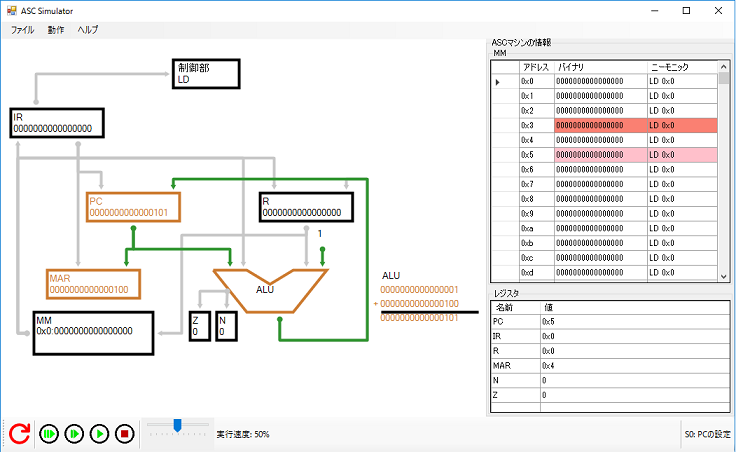
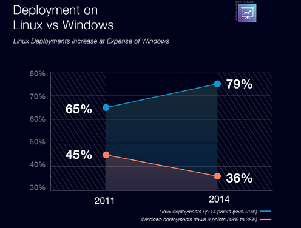
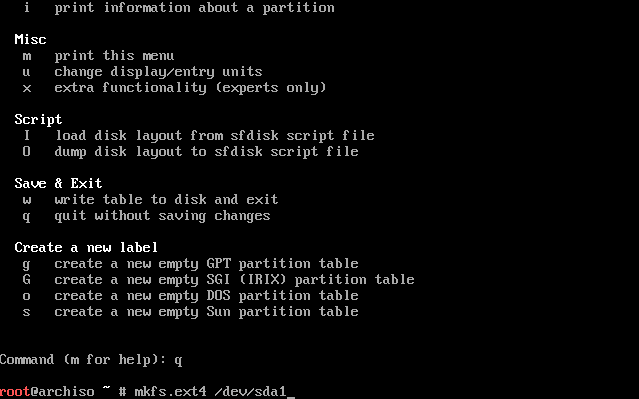
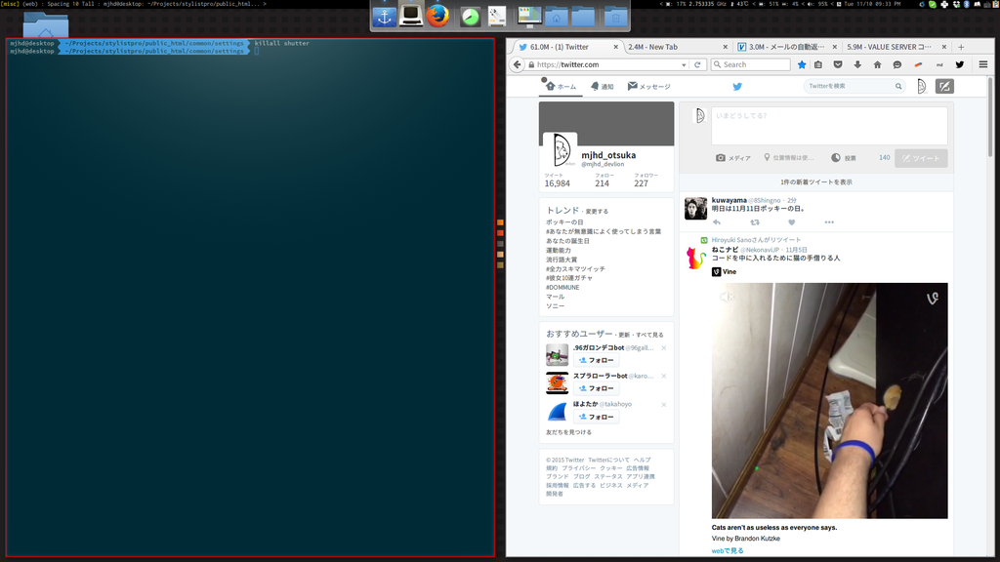
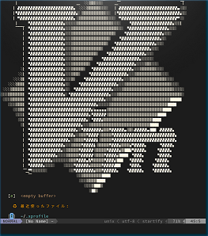
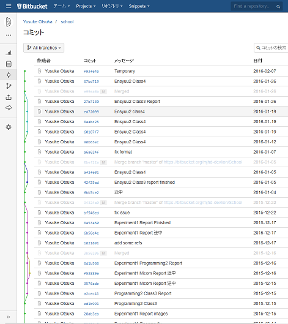

# Linuxのすゝめ
宇大情報工学科3年生(本当は4年生のはず)  
  
Twitter: [@mjhd_devlion](https://twitter.com/mjhd_devlion/)  
Web: [http://devlion.net](http://devlion.net)

---

# 自己紹介
* プログラミングが好き
* 最近はWebデザインをよくやっている

---

# こんなのつくりました
 
[新電力バンク](https://www.shindenryoku.pw)  


# HSP部屋

[HSP部屋](http://hsproom.me)  



# ASC
* Simulator&Assembler



---

# 本題
* もうパソコンは買いましたか？

---
 
# Linuxを入れましょう
 


* Windows, Macintoshと同じ、OSの一つ
* 世界のサーバ用OSのシェア一位



[進む大企業のLinux導入--Windowsのシェアは減少](http://japan.zdnet.com/article/35057416/)より


# 特にWeb関連はLinuxの知識が必要

---

# ディストリビューション
* Linuxにはディストリビューションと呼ばれるパッケージが沢山ある
* Ubuntu, Fedora, CentOSなど沢山ある

---

# ArchLinux


---

# メリット
* 勉強になる
* 日本語のWikiがかなり充実([ArchLinuxJP Wiki](https://wiki.archlinuxjp.org/index.php/%E3%83%93%E3%82%AE%E3%83%8A%E3%83%BC%E3%82%BA%E3%82%AC%E3%82%A4%E3%83%89))
* パッケージ数が尋常じゃない(ソフトを簡単にインストールできる)


# なぜ勉強になるか？
* インストールが手動(OSの起動方法に関する知識がかなり付く)
* 何か問題が起こった時、C言語などの知識が必要
* あまりゲームができない


# インストールの様子


---

# GUI環境
* XServer
* DisplayManager
* WindowManager
を入れればWindowsみたいに使える


# 実際のArchLinuxの様子



# DisplayManager
* LightDMがおすすめ
* 正直なんでもいい気がする


# XMonad
* タイル型WM
* Haskell(言語)で設定ファイルを書く
* 勉強になる

```
import XMonad
import XMonad.Hooks.ManageDocks

main=do
  xmonad $ defaultConfig
    { ...
    , layoutHook=avoidStruts $ layoutHook defaultConfig
    , manageHook=manageHook defaultConfig <+> manageDocks
    , ...
    }
```


# Haskell
* 今はやりの関数型言語
* モナドなど、本格的に理解しようとすると結構勉強になる
* C言語などとはまったく別の考え方が必要


---

# CUI環境


# vim
* エディタ  
* 世界で一番使いやすいエディタ(emacsよりも)  




# git
* バージョン管理  
* レポートや、学校の課題も管理できる  


---

# おわり
* Windows消すときは自己責任で


